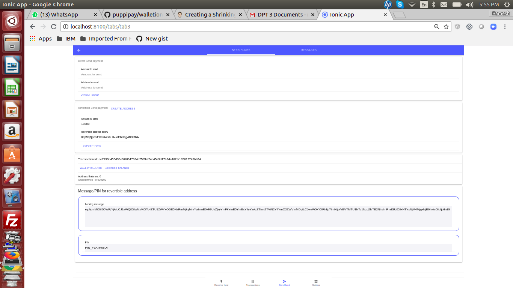
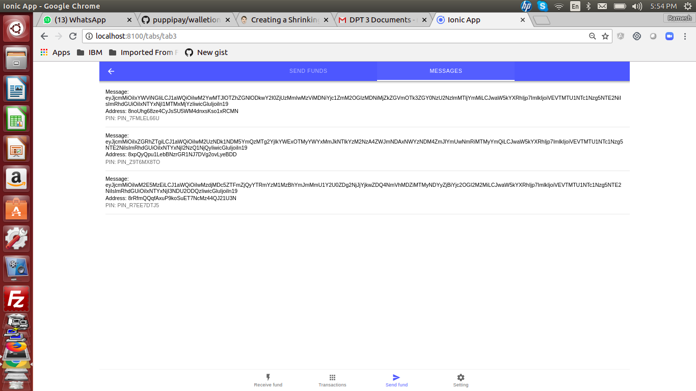
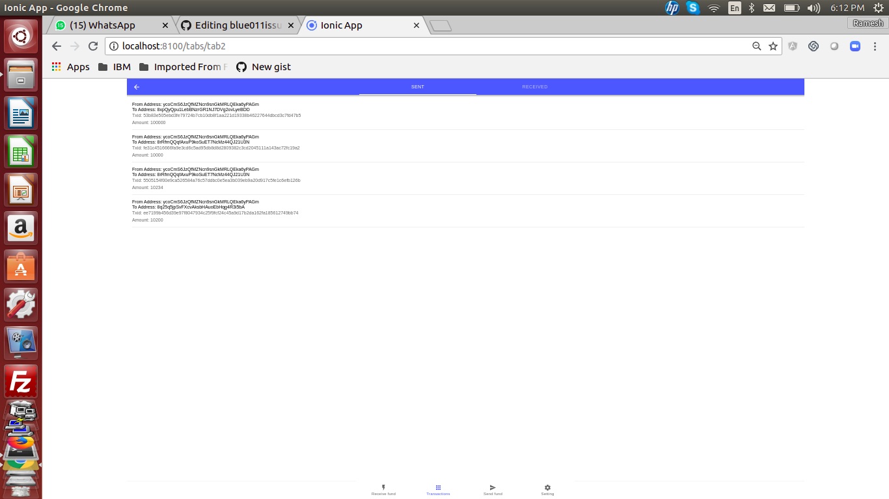
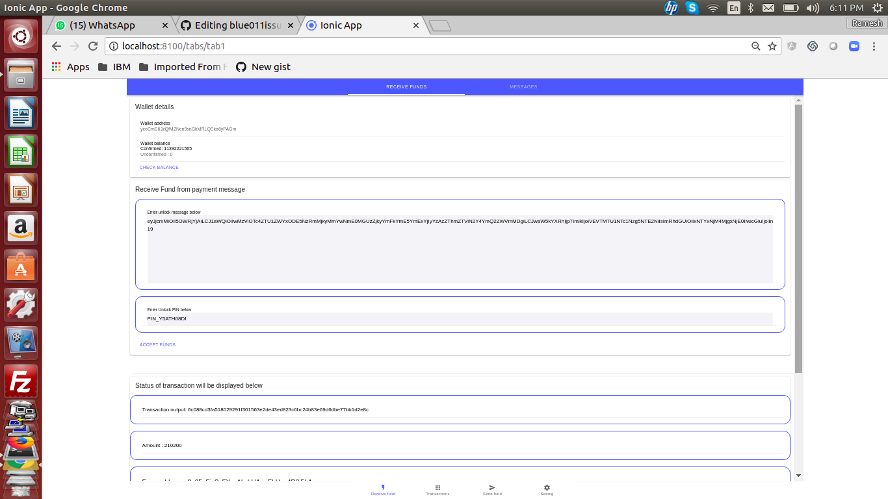
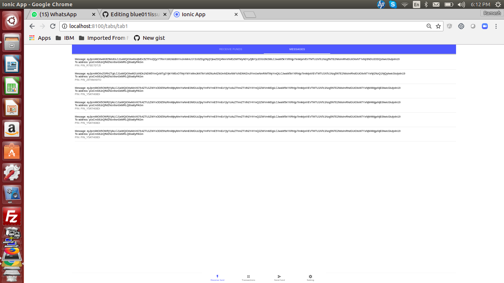
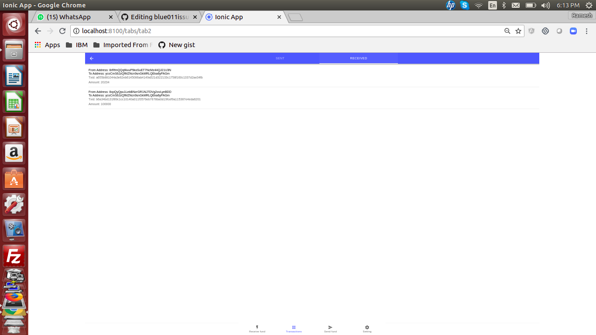

## Ionic 4 Dash wallet with revertible payment address

# Steps to use 

- Clone the Ionic app provided and run

``` bash

npm install

```

- Run Ionic app provided
``` bash
 ionic serve


```
## The DASH app has following tabs and features

4 Tabs

- Recieve funds 
- Transactions
- Send funds
- Settings

# Details in tabs

Settings tab

- You can create testnet wallet
- Check balance

Send fundst tab
- Send funds directly to any address
- Send funds through revertible address
- Stores Message/PIn for sent messages

Transactions tab

- Displays sent transactions
- Displays received funds

Receive funds tab

- Receive funds directly to wallet address
- Receive funds through revertible address (entering message and pin)
- Stores Message/PIn for receved funds


## Load DASH testcoins to wallet address before using


The link to get DASH testcoins is 

http://faucet.test.dash.crowdnode.io


## Images of features


## Confirm the DASH testcoins are received

In the settings tab, click on get balance.


## Send funds through revertible address  

In the "send funds" tab

Create revertible address and

Deposit funds as in



## See message/pin for unlocking revertible address  

In the "send funds" tab, click on messages

See the message/pin 




## See transaction for sent transaction

In the "Transactions" tab, click on "sent"




## Receive funds through revertible address  

In the "Receive funds" tab

Copy paste Message and PIN    

Click "Accept funds". Funds get credited to your account




## See message/pin for getting funds from revertible address  

In the "Received funds" tab, click on "messages"

See the message/pin 




## See transaction for received funds

In the "Transactions" tab, click on "received"




