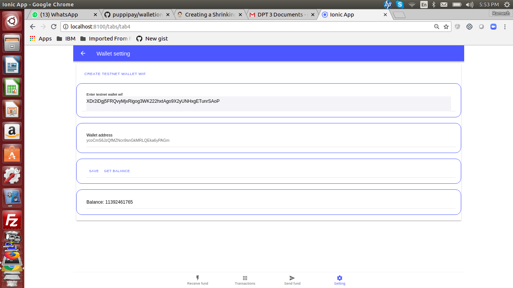

# walletionic4

Clone the Ionic app provided

npm install

Run Ionic app provided

ionic serve

# Images of steps

## Load some DASH testcoins to wallet address

The link to get DASH testcoins is 

http://faucet.test.dash.crowdnode.io

## Confirm the DASH testcoins are received

In the settings tab, click on get balance.

## Send funds through revertible address  

In the "send funds" tab

Create revertible address and

Deposit funds as in

## See message/pin for unlocking revertible address  

In the "send funds" tab, click on messages

See the message/pin 

## See transaction for sent transaction

In the "Transactions" tab, click on "sent"

## Receive funds through revertible address  

In the "Receive funds" tab

Copy paste Message and PIN    

Click "Accept funds". Funds get credited to your account

## See message/pin for getting funds from revertible address  

In the "Received funds" tab, click on "messages"

See the message/pin 

## See transaction for received funds

In the "Transactions" tab, click on "received"

